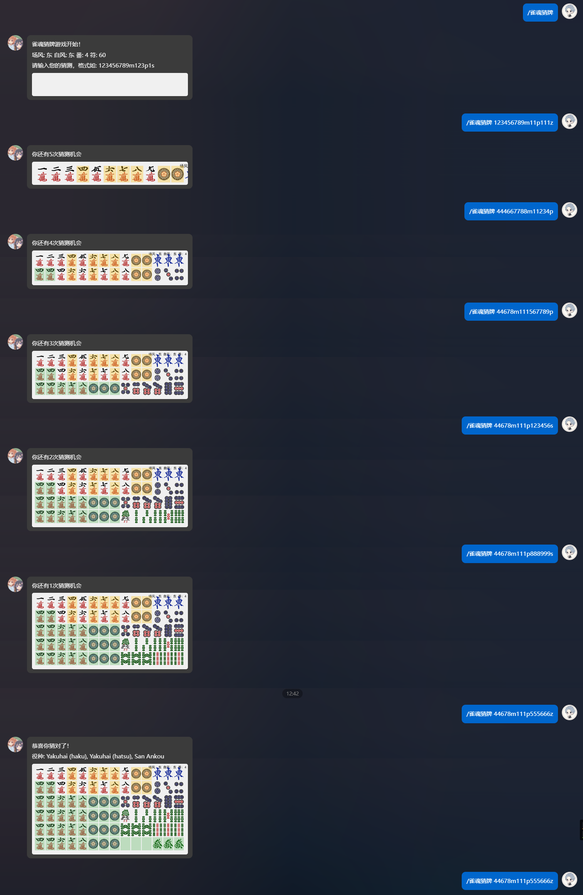

# 雀魂多功能插件 (AstrBot Plugin Majsoul)

这是一个为AstrBot开发的雀魂多功能插件，提供雀魂战绩查询、模拟抽卡等功能。
目前仍为开发测试阶段，可能存在未知问题。

## 功能特点

1. **战绩查询**
   - 基本战绩查询：查询玩家的基本对局数据
   - 详细战绩查询：查询玩家在特定场次（金/玉/王座）的详细数据
   - 牌谱查询：查询玩家最近的对局记录
   - 综合查询：同时查询玩家的战绩统计和最近对局记录

2. **模拟抽卡**
   - 十连抽：模拟雀魂游戏中的十连抽
   - 卡池切换：切换不同的卡池
   - 查看卡池：查看当前生效的卡池

3. **牌理分析**
   - 分析手牌：分析指定手牌的牌理

## 使用方法

### 查询功能

- `雀魂信息/雀魂查询 昵称`：查询该ID的雀魂基本对局数据
- `三麻信息/三麻查询 昵称`：查询该ID雀魂三麻的基本对局数据
- `雀魂信息/雀魂查询 (金/金之间/金场/玉/王座) 昵称`：查询该ID在金/玉/王座之间的详细数据
- `三麻信息/三麻查询 (金/金之间/金场/玉/王座) 昵称`：查询该ID在三麻金/玉/王座之间的详细数据
- `雀魂牌谱 昵称`：查询该ID下最近五场的对局信息
- `三麻牌谱 昵称`：查询该ID下最近五场的三麻对局信息
- `雀魂详细 昵称`：查询该ID的详细战绩（包括战绩统计和最近对局记录）
- `三麻详细 昵称`：查询该ID的三麻详细战绩（包括战绩统计和最近对局记录）

### 抽卡功能

- `雀魂十连`：来一发当前群内卡池的十连抽
- `切换雀魂卡池 <卡池名称>`：切换本群的雀魂卡池
- `查看雀魂卡池`：查看本群当前生效的雀魂卡池

### 牌理功能

- `牌理 <手牌>`：分析麻将手牌，计算向听数和进张
  - 例如：`牌理 1112345678999m`
  - 支持的牌表示法：
    - m: 万子
    - p: 筒子
    - s: 索子
    - z: 字牌（1-7，分别代表东南西北白发中）
  - 支持分析13张牌（听牌）和14张牌（和牌）
  - 可以分析向听数、进张、役种和点数等信息
  - 支持特殊和牌形式如七对子、国士无双等的识别

### 雀魂wordle功能
- `雀魂猜牌`：开始雀魂wordle

### 管理功能

- `雀魂开`：启用雀魂插件
- `雀魂关`：禁用雀魂插件

## 注意事项

- 由于牌谱屋只统计金之间以上的数据，请确保查询的玩家在金之间有过对局记录
- 抽卡功能模拟的是雀魂游戏中的抽卡系统，仅供娱乐
- 牌理分析功能需要按照特定格式输入手牌，例如：`123456789m`表示万子1-9

## 配置说明

插件配置文件位于`config.json`，主要配置项包括：

- `api_url`：牌谱屋API地址
- `default_pool`：默认卡池
- `enable_image_output`：是否启用图片输出
- `debug_mode`：是否启用调试模式
- `extended_query`：扩展查询相关配置
  - `default_records_limit`：默认查询记录数量
  - `default_mode`：默认游戏模式（four/three）
  - `default_level`：默认房间等级（all/bronze/silver/gold/jade/throne）

## 更新日志

### v1.4.1
- 加入生成新题库，fix something

### v1.4.0
- 更新了日麻wordle游戏

### v1.3.0
- 完善了牌理计算牌效

### v1.2.0
- 新增中文役种
- 新增玩家tag
- 增加了角色资源

### v1.1.0
- 新增详细战绩查询功能
- 新增牌谱查询功能
- 优化查询结果显示

### v1.0.0
- 初始版本发布
- 实现基本战绩查询
- 实现模拟抽卡功能 