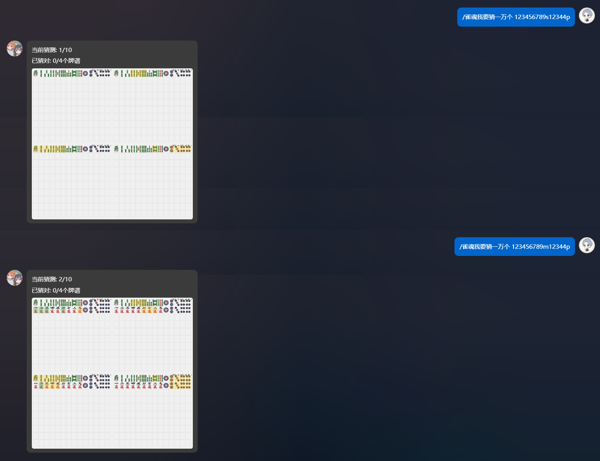

# 雀魂多功能插件 (AstrBot Plugin Majsoul)

这是一个为AstrBot开发的雀魂多功能插件，提供雀魂战绩查询、模拟抽卡、牌谱拉取等功能。
目前仍为开发测试阶段，可能存在未知问题。

## 功能特点

1. **战绩查询**
   - 基本战绩查询：查询玩家的基本对局数据
   - 详细战绩查询：查询玩家在特定场次（金/玉/王座）的详细数据
   - 牌谱查询：查询玩家最近的对局记录
   - 综合查询：同时查询玩家的战绩统计和最近对局记录

2. **模拟抽卡**
   - 十连抽：模拟雀魂游戏中的十连抽
   - 卡池切换：切换不同的卡池
   - 查看卡池：查看当前生效的卡池

3. **牌理分析**
   - 分析手牌：分析指定手牌的牌理

4. **麻将猜牌游戏**
   - 单牌谱猜牌：传统Wordle风格的猜牌游戏
   - 多牌谱猜牌：同时猜测4个牌谱的高难度模式

5. **牌谱拉取（原始JSON）**
   - 国服账号池登录（管理员）
   - 牌谱链接/paipu_id 拉取并缓存

6. **WebUI 管理**
   - 在 AstrBot 插件详情页打开雀魂管理页面
   - 管理国服账号池、牌谱缓存、牌谱拉取和牌谱分析
   - 查看单局结果、巡目状态和玩家摸打轨迹

## 使用方法

### 查询功能

- `雀魂信息/雀魂查询 昵称`：查询该ID的雀魂基本对局数据
- `三麻信息/三麻查询 昵称`：查询该ID雀魂三麻的基本对局数据
- `雀魂信息/雀魂查询 (金/金之间/金场/玉/王座) 昵称`：查询该ID在金/玉/王座之间的详细数据
- `三麻信息/三麻查询 (金/金之间/金场/玉/王座) 昵称`：查询该ID在三麻金/玉/王座之间的详细数据
- `雀魂牌谱 昵称`：查询该ID下最近五场的对局信息
- `三麻牌谱 昵称`：查询该ID下最近五场的三麻对局信息
- `雀魂详细 昵称`：查询该ID的详细战绩（包括战绩统计和最近对局记录）
- `三麻详细 昵称`：查询该ID的三麻详细战绩（包括战绩统计和最近对局记录）
- `雀魂牌谱` 的输出会附带可直接执行 `雀魂review` 的链接（用于拉取原始牌谱）

### 牌谱拉取功能

- `雀魂review <牌谱URL|paipu_id>`：拉取并缓存原始牌谱（`raw.json`）

### 账号池管理（管理员）

- `雀魂登录国服 <用户名> <密码>`：添加或更新国服登录账号
- `雀魂登录列表`：查看账号池状态（脱敏）
- `雀魂登录删除 <序号|uid|用户名>`：删除账号

### WebUI 管理

AstrBot 新版支持插件 Pages 后，可以在 WebUI 的插件管理中进入本插件详情页，打开 `dashboard` 页面。

WebUI 提供以下管理入口：

- 概览：查看插件版本、数据目录、账号池状态、牌谱缓存数量和缓存大小
- 账号池：添加/更新国服账号、删除账号、测试账号可用性
- 牌谱：查看缓存的 `raw.json`、搜索、下载、删除、拉取新的牌谱
- 分析：查看牌谱局列表、单局结果、巡目状态和玩家摸打轨迹

安全说明：

- WebUI 走 AstrBot 管理面板鉴权，不会单独启动端口
- 账号池接口只返回脱敏用户名、token 是否存在、账号状态和错误摘要
- WebUI 不会返回密码和 token 明文

### 抽卡功能

- `雀魂十连`：来一发当前群内卡池的十连抽
- `切换雀魂卡池 <卡池名称>`：切换本群的雀魂卡池
- `查看雀魂卡池`：查看本群当前生效的雀魂卡池

### 牌理功能

- `牌理 <手牌>`：分析麻将手牌，计算向听数和进张
  - 例如：`牌理 1112345678999m`
  - 支持的牌表示法：
    - m: 万子
    - p: 筒子
    - s: 索子
    - z: 字牌（1-7，分别代表东南西北白发中）
  - 支持分析13张牌（听牌）和14张牌（和牌）
  - 可以分析向听数、进张、役种和点数等信息
  - 支持特殊和牌形式如七对子、国士无双等的识别

### 雀魂猜牌功能
- `雀魂猜牌`：开始雀魂wordle游戏

### 雀魂多牌谱猜牌功能
- `雀魂我要猜一万个`：开始雀魂多牌谱wordle游戏
  - 同时猜测4个不同牌谱
  - 共有10次猜测机会
  - 更具挑战性的高级模式

### 管理功能

- `雀魂开`：启用雀魂插件
- `雀魂关`：禁用雀魂插件

## 注意事项

- 由于牌谱屋只统计金之间以上的数据，请确保查询的玩家在金之间有过对局记录
- 抽卡功能模拟的是雀魂游戏中的抽卡系统，仅供娱乐
- 牌理分析功能需要按照特定格式输入手牌，例如：`123456789m`表示万子1-9

## 配置说明

插件配置文件位于`config.json`，主要配置项包括：

- `api_url`：牌谱屋API地址
- `default_pool`：默认卡池
- `webui_enable`：是否启用雀魂插件 WebUI 后端接口，默认启用
- `webui_timeout_seconds`：WebUI 执行登录、牌谱拉取等长任务时的超时时间，默认 180 秒
- `webui_error_preview_length`：WebUI 展示账号错误信息时的最大字符数，默认 240

更新日志见 [CHANGELOG.md](CHANGELOG.md)。
